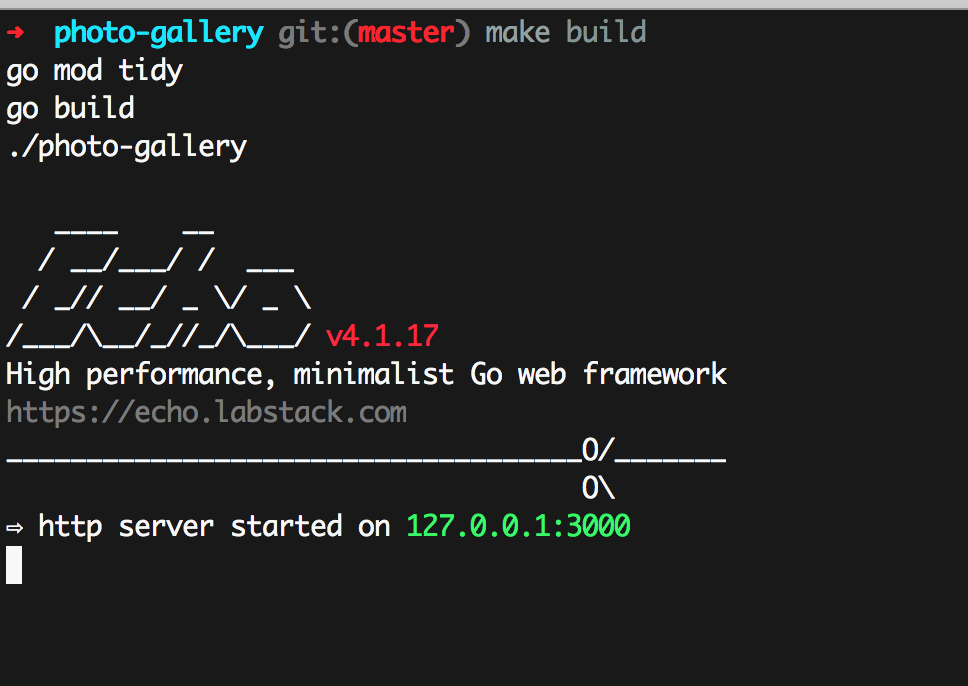
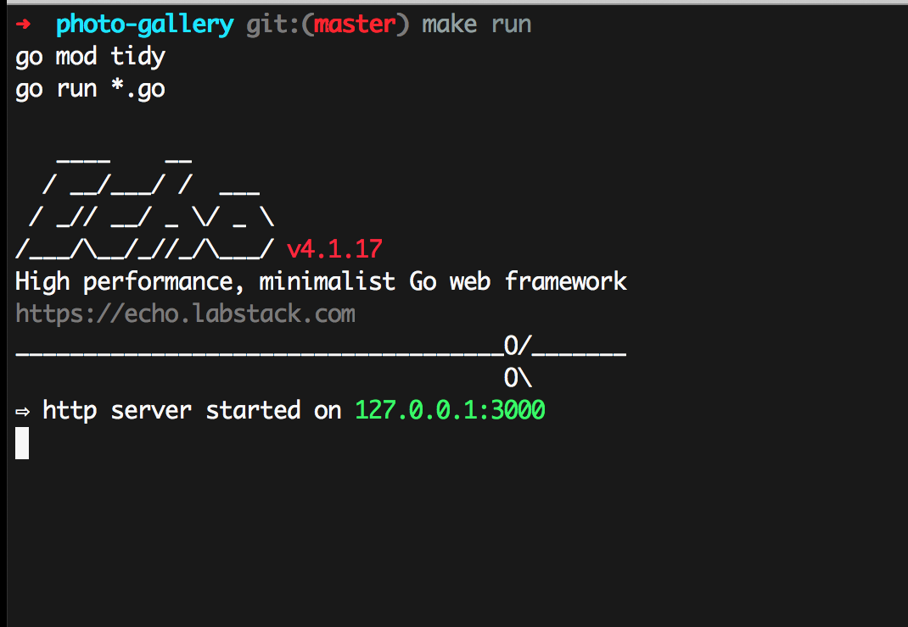
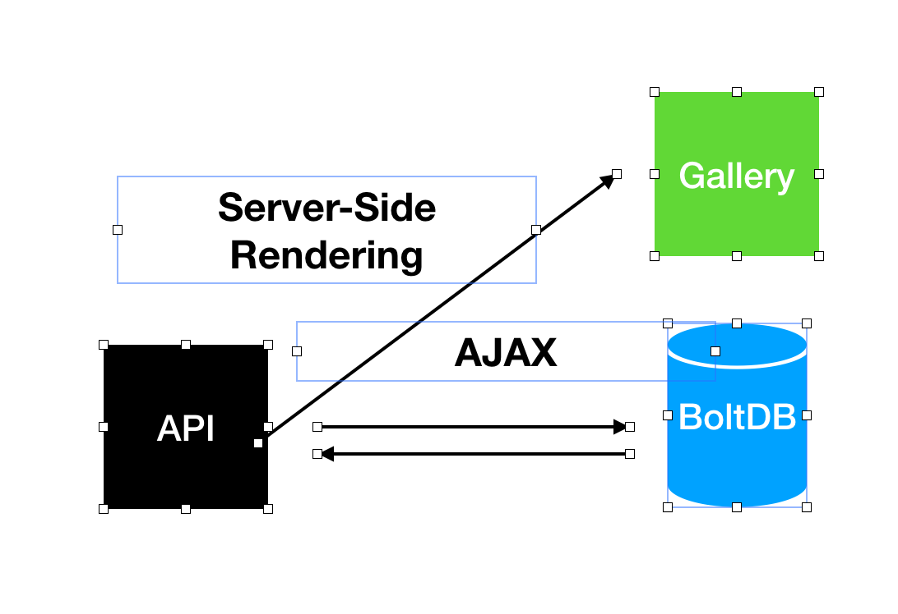

# photo-gallery

# Summary

In this applicaion I've used minimalist Go web framework Echo to do the heavy work for back-end API and template rendering, 
After that BoltDB comes into play as key-value storage which provides corss-platform compilation for storing information and
for displaying the images I've used CSS Grid and AJAX to make the UI more smooth.

- [x] jQuery
- [x] AJAX
- [x] Go
- [x] BoltDB
- [x] Echo -- > minimalist Go web framework 

# How to run it?

You can either download the zip file or `git clone git@github.com:alirezaly/photo-gallery.git` into your computer then simply
run `make build` to run the application as a binary or `make run` to temporarly run the applicaion.

# How it works?
This application provides a kind of simple old-school monolith with that provides server-side rendering
from Echo framework and updating the view usign jQuery after successfull AJAX calls.

